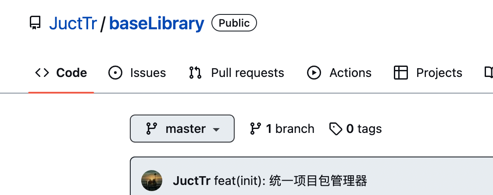

# baseLibrary
搭建一个基础组件库的过程


## 初始化项目

```bash
username@usernameMacBook-Pro baseLibrary % pnpm init

Wrote to /Users/wangyicong/Desktop/baseLibrary/package.json

{
  "name": "baseLibrary",
  "version": "1.0.0",
  "description": "",
  "main": "index.js",
  "scripts": {
    "test": "echo \"Error: no test specified\" && exit 1"
  },
  "keywords": [],
  "author": "",
  "license": "ISC"
}
```

## 统一项目包管理器

强制使用pnpm来初始化我们的项目

在`package.json`文件中，加入一下脚本

```json
{
	...
  "scripts": {
		"preinstall": "npx only-allow pnpm",
    "test": "echo \"Error: no test specified\" && exit 1"
  },
	...
}

```

我们尝试使用`npm install`，看出现什么效果？

```bash
username@usernamedeMacBook-Pro baseLibrary % npm install

> base-library@1.0.0 preinstall /Users/username/Desktop/baseLibrary
> npx only-allow pnpm

npx: 20 安装成功，用时 8.703 秒
╔═════════════════════════════════════════════════════════════╗
║                                                             ║
║   Use "pnpm install" for installation in this project.      ║
║                                                             ║
║   If you don't have pnpm, install it via "npm i -g pnpm".   ║
║   For more details, go to https://pnpm.js.org/              ║
║                                                             ║
╚═════════════════════════════════════════════════════════════╝
npm ERR! code ELIFECYCLE
npm ERR! errno 1
npm ERR! base-library@1.0.0 preinstall: `npx only-allow pnpm`
npm ERR! Exit status 1
npm ERR! 
npm ERR! Failed at the base-library@1.0.0 preinstall script.
npm ERR! This is probably not a problem with npm. There is likely additional logging output above.

npm ERR! A complete log of this run can be found in:
npm ERR!     /Users/username/.npm/_logs/2022-12-26T13_38_33_479Z-debug.log
```

当然我们也可以在`pnpm install`前后执行其他自定义逻辑，如下：

```bash
{
	...
  "scripts": {
		"preinstall": "npx only-allow pnpm && node ./build/pre-install", // && 我们也可以换成 || ，逻辑同js运算符
		"postinstall": "node ./build/post-install",
    "test": "echo \"Error: no test specified\" && exit 1"
  },
	...
}
```

添加`pre-install.js`文件

```javascript
#!/usr/bin/env node
console.log("npm_execpath", process.env.npm_execpath);
console.log("npm_config_user_agent", process.env.npm_config_user_agent);
console.log("【⚠️注意】=> ", "请使用pnpm包管理工具哦");

```

添加`post-install.js`文件

```js
#!/usr/bin/env node
console.log("【⚠️注意】=> ", "使用pnpm install 后执行");
```

效果如下：

```bash
username@usernamedeMacBook-Pro baseLibrary % pnpm install
Already up to date

> base-library@1.0.0 preinstall /Users/username/Desktop/baseLibrary
> npx only-allow pnpm && node ./build/pre-install

npx: 20 安装成功，用时 2.487 秒
npm_execpath /Users/username/.nvm/versions/node/v14.19.3/lib/node_modules/pnpm/bin/pnpm.cjs
npm_config_user_agent pnpm/7.17.1 npm/? node/v14.19.3 darwin x64
【⚠️注意】=>  请使用pnpm包管理工具哦

> base-library@1.0.0 postinstall /Users/username/Desktop/baseLibrary
> node ./build/post-install

【⚠️注意】=>  使用pnpm install 后执行
Done in 3s
```


### 参考来源

[下一代的前端工具链 vite ](https://github.com/vitejs/vite)

[【若川视野 x 源码共读】16期 - preinstall钩子和only-allow](https://juejin.cn/post/7091984044166447141)

https://docs.npmjs.com/cli/v8/using-npm/scripts#npm-install


## 小插曲

在上一节中，我考虑我使用`Typora`写md文档时，难免会在本地复制粘贴一些图片，我们来看路径长什么样？

这样：`/Users/username/Library/Application Support/typora-user-images/image-20221226221413625.png`

那么我可不可以把以上的路径，在`git commit`之前，把他扭转为`项目根路径/assets/img/image-20221226221413625.png`，再commit？





