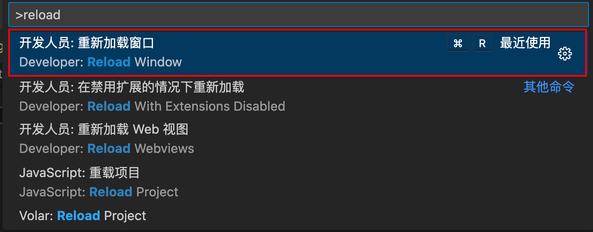
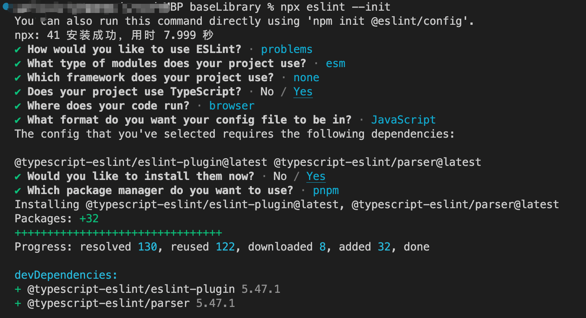
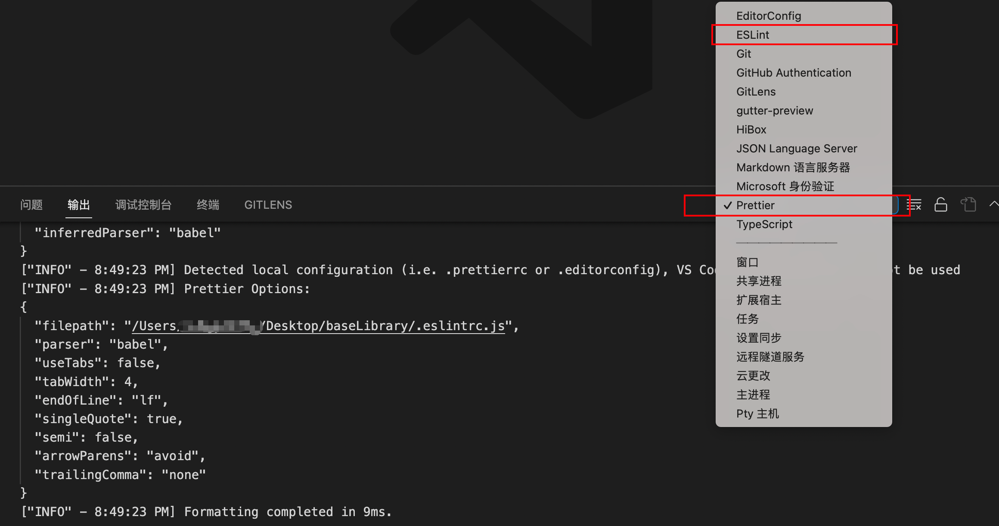
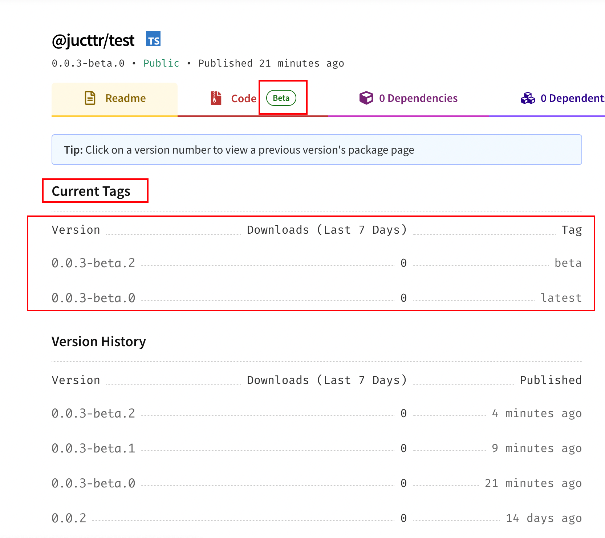

<!-- START doctoc generated TOC please keep comment here to allow auto update -->
<!-- DON'T EDIT THIS SECTION, INSTEAD RE-RUN doctoc TO UPDATE -->
**目录**

- [baseLibrary](#baselibrary)
  - [初始化项目](#%E5%88%9D%E5%A7%8B%E5%8C%96%E9%A1%B9%E7%9B%AE)
  - [包管理器](#%E5%8C%85%E7%AE%A1%E7%90%86%E5%99%A8)
    - [总结](#%E6%80%BB%E7%BB%93)
    - [参考来源](#%E5%8F%82%E8%80%83%E6%9D%A5%E6%BA%90)
  - [小插曲](#%E5%B0%8F%E6%8F%92%E6%9B%B2)
  - [Git Hooks](#git-hooks)
    - [husky](#husky)
      - [自动安装](#%E8%87%AA%E5%8A%A8%E5%AE%89%E8%A3%85)
  - [代码规范](#%E4%BB%A3%E7%A0%81%E8%A7%84%E8%8C%83)
    - [eslint](#eslint)
    - [prettier](#prettier)
    - [Lint-staged](#lint-staged)
    - [Git 提交信息规范](#git-%E6%8F%90%E4%BA%A4%E4%BF%A1%E6%81%AF%E8%A7%84%E8%8C%83)
      - [commitlint](#commitlint)
  - [代码打包](#%E4%BB%A3%E7%A0%81%E6%89%93%E5%8C%85)
    - [参考来源](#%E5%8F%82%E8%80%83%E6%9D%A5%E6%BA%90-1)
  - [多包依赖管理](#%E5%A4%9A%E5%8C%85%E4%BE%9D%E8%B5%96%E7%AE%A1%E7%90%86)
    - [参考来源](#%E5%8F%82%E8%80%83%E6%9D%A5%E6%BA%90-2)
  - [包版本更新和发布](#%E5%8C%85%E7%89%88%E6%9C%AC%E6%9B%B4%E6%96%B0%E5%92%8C%E5%8F%91%E5%B8%83)
    - [新手指南](#%E6%96%B0%E6%89%8B%E6%8C%87%E5%8D%97)
    - [借助 Lerna](#%E5%80%9F%E5%8A%A9-lerna)
      - [安装 Lerna](#%E5%AE%89%E8%A3%85-lerna)
      - [初始化](#%E5%88%9D%E5%A7%8B%E5%8C%96)
    - [参与开发注意事项](#%E5%8F%82%E4%B8%8E%E5%BC%80%E5%8F%91%E6%B3%A8%E6%84%8F%E4%BA%8B%E9%A1%B9)
    - [参考来源](#%E5%8F%82%E8%80%83%E6%9D%A5%E6%BA%90-3)
  - [自动化部署](#%E8%87%AA%E5%8A%A8%E5%8C%96%E9%83%A8%E7%BD%B2)
- [开发指引](#%E5%BC%80%E5%8F%91%E6%8C%87%E5%BC%95)

<!-- END doctoc generated TOC please keep comment here to allow auto update -->

# baseLibrary

本项目描述从 零 到 一 搭建一个基础工具库的工程化流程。

## 初始化项目

请带着问题开始：

1.  `npm`早期版本（v1/v2）的工作模式存在着什么问题？
1.  `npm`v3 做了什么事情？还存在什么问题？
1.  为什么会有`.lock`文件？`workspaces`是什么东西？
1.  `pnpm`的依赖管理策略，解决了什么问题？有什么特点？
1.  什么是`monorepo`？我们应该怎么使用它？

```bash
username@usernameMacBook-Pro baseLibrary % pnpm init

Wrote to /Users/wangyicong/Desktop/baseLibrary/package.json

{
  "name": "baseLibrary",
  "version": "1.0.0",
  "description": "",
  "main": "index.js",
  "scripts": {
    "test": "echo \"Error: no test specified\" && exit 1"
  },
  "keywords": [],
  "author": "",
  "license": "ISC"
}
```

## 包管理器

强制使用 pnpm 来初始化我们的项目

在`package.json`文件中，加入一下脚本

```json
{
	...
  "scripts": {
		"preinstall": "npx only-allow pnpm",
    "test": "echo \"Error: no test specified\" && exit 1"
  },
	...
  "packageManager": "pnpm@7.18.1", // 实验属性，确保你的团队使用完全相同的软件包管理器版本
}

```

我们尝试使用`npm install`，看看会出现什么效果？

```bash
username@usernamedeMacBook-Pro baseLibrary % npm install

> base-library@1.0.0 preinstall /Users/username/Desktop/baseLibrary
> npx only-allow pnpm

npx: 20 安装成功，用时 8.703 秒
╔═════════════════════════════════════════════════════════════╗
║                                                             ║
║   Use "pnpm install" for installation in this project.      ║
║                                                             ║
║   If you don't have pnpm, install it via "npm i -g pnpm".   ║
║   For more details, go to https://pnpm.js.org/              ║
║                                                             ║
╚═════════════════════════════════════════════════════════════╝
npm ERR! code ELIFECYCLE
npm ERR! errno 1
npm ERR! base-library@1.0.0 preinstall: `npx only-allow pnpm`
npm ERR! Exit status 1
npm ERR!
npm ERR! Failed at the base-library@1.0.0 preinstall script.
npm ERR! This is probably not a problem with npm. There is likely additional logging output above.

npm ERR! A complete log of this run can be found in:
npm ERR!     /Users/username/.npm/_logs/2022-12-26T13_38_33_479Z-debug.log
```

当然我们也可以在`pnpm install`前后执行其他自定义逻辑，如下：

```bash
{
	...
  "scripts": {
		"preinstall": "npx only-allow pnpm && node ./build/pre-install", // && 我们也可以换成 || ，逻辑同js运算符
		"postinstall": "node ./build/post-install",
    "test": "echo \"Error: no test specified\" && exit 1"
  },
	...
}
```

添加`pre-install.js`文件

```javascript
#!/usr/bin/env node
console.log('npm_execpath', process.env.npm_execpath)
console.log('npm_config_user_agent', process.env.npm_config_user_agent)
console.log('【⚠️注意】=> ', '请使用pnpm包管理工具哦')
```

添加`post-install.js`文件

```js
#!/usr/bin/env node
console.log('【⚠️注意】=> ', '使用pnpm install 后执行')
```

效果如下：

```bash
username@usernamedeMacBook-Pro baseLibrary % pnpm install
Already up to date

> base-library@1.0.0 preinstall /Users/username/Desktop/baseLibrary
> npx only-allow pnpm && node ./build/pre-install

npx: 20 安装成功，用时 2.487 秒
npm_execpath /Users/username/.nvm/versions/node/v14.19.3/lib/node_modules/pnpm/bin/pnpm.cjs
npm_config_user_agent pnpm/7.17.1 npm/? node/v14.19.3 darwin x64
【⚠️注意】=>  请使用pnpm包管理工具哦

> base-library@1.0.0 postinstall /Users/username/Desktop/baseLibrary
> node ./build/post-install

【⚠️注意】=>  使用pnpm install 后执行
Done in 3s
```

当然我们也可以不使用`npx only-allow pnpm`，也可以自己写一个脚本如下：

```bash
const agent = process.env.npm_config_user_agent
const { error } = console

if (!agent.startsWith('pnpm')) {
    error('\n 在这个仓库中，请使用 pnpm 来管理依赖。$ npm i pnpm -g\n')
    process.exit(1)
}
```

使用：

```json
{
	...
  "scripts": {
		"preinstall": "node ./build/pre-install",
  },
	...
}
```

### 总结

-   package.json 文件的 "scripts "属性支持一些内置的脚本和它们预设的生命周期事件，以及任意的脚本。这些都可以通过运行 npm run-script <stage>或简称 npm run <stage>来执行。

### 参考来源

[下一代的前端工具链 vite ](https://github.com/vitejs/vite)

[【若川视野 x 源码共读】16 期 - preinstall 钩子和 only-allow](https://juejin.cn/post/7091984044166447141)

https://docs.npmjs.com/cli/v8/using-npm/scripts#npm-install

https://docs.npmjs.com/cli/v7/using-npm/scripts

## 小插曲

在上一节中，我考虑我使用`Typora`写 md 文档时，难免会在本地复制粘贴一些图片，我们来看路径长什么样？

这样：`/Users/username/Library/Application Support/typora-user-images/image-20221226221413625.png`

那么我可不可以把以上的路径，在`git commit`之前，把他扭转为`项目根路径/assets/images/image-20221226221413625.png`，再 commit？

~~用我的蹩脚 shell 命令，搞一个脚本来解决这个问题。~~

不废话，两个目的：

1. 把`/Users/username/Library/Application Support/typora-user-images/`目录下的文件，复制到项目根目录下的`/assets/images/`
2. `git commit`之前，把`*.md`文档中，所有的`/Users/username/Library/Application Support/typora-user-images/，` 替换为`./assets/images/`

新增`copy-img.js`文件

```js
const path = require('path')
const fs = require('fs')

function copyTyporaImgToProjectAssets() {
    // Typora 软件存放图片的位置
    const typoraImgDir = path.resolve(
        process.env.HOME,
        'Library/Application Support/typora-user-images'
    )
    // 项目存放图片的位置
    const assetsDir = path.resolve(process.cwd(), 'assets/images')

    // 读取typoraImgDir目录所有图片
    const allImgs = fs.readdirSync(typoraImgDir)
    // 把当天添加的图片，都复制到项目图片目录来
    const year = new Date().getFullYear().toString()
    const month = (new Date().getMonth() + 1).toString()
    const day = new Date().getDate().toString()

    const toDay = year + month + day

    console.log('【当前日期】=> ', toDay)

    const toDayImgs = allImgs.filter(item => {
        const m = item.match(/image-(\d{0,8})/)
        if (!m.length) return false
        const mDay = m[1] || ''
        if (mDay === toDay) return true
    })
    toDayImgs.forEach(item => {
        const localImgDir = path.resolve(typoraImgDir, item)
        const assetsImgDir = path.resolve(assetsDir, item)
        fs.copyFileSync(localImgDir, assetsImgDir)
    })
}

copyTyporaImgToProjectAssets()

module.exports = {
    copyTyporaImgToProjectAssets
}
```

新增一个 node 脚本`replace-img-path.js`，脚本有点简陋，凑合着看看

```shell
const path = require("path");
const fs = require("fs");
const chalk = require("chalk");
const { spawn } = require("child_process");

const HOME_DIR = process.env.HOME;

const CWD = process.cwd();

const DEFAULT_OPTION = {
  filesDir: CWD,
  extension: ".md",
  matchContent: "",
  targetContent: "",
};

function replaceFileContent(options = DEFAULT_OPTION) {
  const { filesDir, extension, matchContent, targetContent } = options;

  fs.readdir(filesDir, "utf8", function (err, files) {
    if (err) return console.log(chalk.redBright(`【读取目录出错】=> `, err));

    //根据后缀名筛选要操作的文件
    const targetFiles = files.filter(function (file) {
      return path.extname(file).toLowerCase() === extension;
    });

    if (!targetFiles.length) return null;

    targetFiles.forEach((item) => {
      const targetFilePath = path.join(filesDir, item);

      console.log("【pre-commit】=> 变更文件", targetFilePath);

      fs.readFile(targetFilePath, "utf8", function (err, data) {
        if (err)
          return console.log(chalk.redBright(`【读取文件出错】=> `, err));
        const result = data.replace(
          new RegExp(matchContent, "g"),
          targetContent
        );
        fs.writeFile(targetFilePath, result, "utf8", function (err) {
          if (err)
            return console.log(chalk.redBright(`【写入文件出错】=> `, err));
          console.log(
            chalk.greenBright("【pre-commit】=> ", "替换图片路径成功～")
          );
          // 提交该文件
          spawn("git", ["add", targetFilePath]);
        });
      });
    });
  });
}

replaceFileContent({
  filesDir: CWD,
  extension: ".md",
  matchContent: `${HOME_DIR}/Library/Application Support/typora-user-images`,
  targetContent: "./assets/images",
});

module.exports = {
  replaceFileContent,
};

```

ps：f\*\*k，一开始没想到用 node 来搞，还一直去折腾 Linux 命令，还写了一个 shell 脚本 🤡

## Git Hooks

带着问题开始：

1. 什么是 Git Hooks？
2. Git Hooks 跟 持续集成（CI/CD）有什么关系，能为工程化项目部署做什么事情？
3. 。。。。。

那么如何在`git commit`之前，执行我们写的脚本呢？

### [husky](https://typicode.github.io/husky/#/)

【含义】：当你提交或推送时，你可以用它来提示你的提交信息，运行测试，提示代码等。husky 支持所有的 Git Hooks。

关于 husky 具体如何高效使用，可以自行查阅官网。

#### 自动安装

```bash
username@usernamedeMBP baseLibrary % pnpm dlx husky-init && pnpm install
.../Library/pnpm/store/v3/tmp/dlx-19030  |   +2 +
.../Library/pnpm/store/v3/tmp/dlx-19030  | Progress: resolved 2, reused 2, downloaded 0, added 2, done
husky-init updating package.json
  "husky install" command already exists in prepare script, skipping.
husky - Git hooks installed
husky - created .husky/pre-commit

please review changes in package.json
Packages: +1
+
Packages are hard linked from the content-addressable store to the virtual store.
  Content-addressable store is at: /Users/username/Library/pnpm/store/v3
  Virtual store is at:             node_modules/.pnpm
Progress: resolved 1, reused 0, downloaded 0, added 0
.......
.......
忽略
```

可以看到我们的项目根目录生成了`.husky`文件，该文件中有一个`pre-commit`脚本，那么我们就可以在这里执行我们的`replace-img-path.js`脚本，替换图片的路径。

在.husky 新建 scripts 目录，把我们写好的`copy-img.js`和`replace-img-path.js`文件放进去，并在`pre-commit`脚本中加入：

```shell
#!/usr/bin/env sh
. "$(dirname -- "$0")/_/husky.sh"

node .husky/scripts/copy-img.js

node .husky/scripts/replace-img-path.js
```

PS：读者可以根据自己电脑类型，和 md 文档软件等，稍微修改`copy-img.js`和`replace-img-path.js`脚本内容。

## 代码规范

请带着问题开始：

1. eslints 和 prettier 的原理是什么？
2. 。。。。。。

这块细节不会讲太多，只是罗列一下步骤，想了解 eslint 文件中，每一个配置项的含义，建议找几个开源的项目并结合官网看看。

> 注意 ⚠️：安装完`eslint`和`prettier`相关的插件包，在验证是否生效前，建议重启一下`vscode`编辑器。



项目根目录新建`.vscode` 文件，加入`settings.json`，编辑器优先应用项目根目录的`settings.json`，再应用编辑器自身的`settings.json`配置。

```json
{
    "editor.defaultFormatter": "esbenp.prettier-vscode",
    "editor.formatOnSave": true,
    "editor.codeActionsOnSave": {
        "source.fixAll": true
    }
}
```

你也可以根据你自己的情况，调整配置

### eslint

```bash
pnpm i eslint -D
```

```bash
npx eslint --init
```



或

```bash
pnpm i typescript @typescript-eslint/eslint-plugin@latest @typescript-eslint/parser@latest -D
```

### prettier

```bash
 pnpm i prettier eslint-config-prettier eslint-plugin-prettier -D
```

.prettierrc.js 文件

```javascript
module.exports = {
    singleQuote: true,
    semi: false,
    arrowParens: 'avoid',
    trailingComma: 'none'
}
```

.eslintrc.js 文件

```javascript
module.exports = {
    env: {
        browser: true,
        commonjs: true,
        es6: true,
        node: true
    },
    globals: {},
    extends: [
        'eslint:recommended',
        'plugin:@typescript-eslint/recommended',
        // 用来覆盖 ESLint 本身的规则配置
        'prettier',
        'plugin:prettier/recommended'
    ],
    overrides: [],
    parser: '@typescript-eslint/parser',
    parserOptions: {},
    // eslint-plugin-prettier 用于让 Prettier 来接管eslint --fix即修复代码的能力
    plugins: ['@typescript-eslint', 'prettier'],
    rules: {
        'prettier/prettier': 'error'
    }
}
```

自行新增`.eslintignore`和`.prettierignore`文件，最终检查编辑器输出这块，没有报错一般就没有问题。



### Lint-staged

【含义】：只对存入`暂存区`的文件进行 Lint 检查，大大提高`commit`代码的效率。

官方仓库：https://github.com/okonet/lint-staged

```bash
pnpm i lint-staged -D
```

package.json 文件添加如下代码（只是一个示例）：

可以自行调整，比如你项目是 React 技术栈，那么可以增加.jsx,.tsx 的校验，如果项目是 Vue 技术栈，可以增加.vue 的校验。。。。。。

```json
{
    ...
    "lint-staged": {
        "*.{ts,js}": [
            "eslint --cache --fix"
        ],
        "**/(package|tsconfig(.*)?).json": [
            "prettier --write"
        ],
        "(pnpm-workspace|.github/**/*).{yml,yaml}": [
            "prettier --write"
        ],
        "((.github/**/*)|(README|CHANGELOG)|(**/(README|CHANGELOG))).md": [
            "prettier --write"
        ]
    }
  ...
}

```

`.husky/pre-commit` 文件中添加：

```bash
#!/usr/bin/env sh
. "$(dirname -- "$0")/_/husky.sh"

node .husky/scripts/copy-img.js

node .husky/scripts/replace-img-path.js

pnpm exec lint-staged --allow-empty
```

### Git 提交信息规范

#### commitlint

官网：https://commitlint.js.org/#/

```bash
pnpm install @commitlint/cli @commitlint/config-conventional -D
```

项目根目录添加`.commitlintrc.js`文件

```javascript
module.exports = {
    extends: ['@commitlint/config-conventional']
}
```

添加 git hooks：

```bash
npx husky add .husky/commit-msg "npx --no-install commitlint -e $HUSKY_GIT_PARAMS"
```

在`.husky`目录下多出了`commit-msg`脚本文件，输入一个错误的 commit 信息，commitlint 会自动抛出错误并退出。

## 代码打包

**......待更新**

### 参考来源

[使用 Vite 和 TypeScript 带你从零打造一个属于自己的 Vue3 组件库](https://www.51cto.com/article/715946.html)

## 多包依赖管理

**......待更新**

### 参考来源

-   [Replacing Lerna + Yarn with PNPM Workspaces](https://www.raulmelo.dev/blog/replacing-lerna-and-yarn-with-pnpm-workspaces)

## 包版本更新和发布

### 新手指南

以下是不借助第三方工具，仅仅是使用`pnpm`自带的`publish`的命令，发布一个公共包的流程。

1. 去官网注册一个 npm 账号；

2. 进到某一个包的目录，执行`pnpm publish`

    ```bash
    username@usernamedeMacBook-Pro test % pnpm publish
    npm notice
    npm notice 📦  @base/test@1.0.0
    npm notice === Tarball Contents ===
    npm notice 288B  dist/index.js
    npm notice 434B  dist/lib/is-plain-object.js
    npm notice 746B  package.json
    npm notice 197B  README.md
    npm notice 255B  dist/index.d.ts
    npm notice 0     types/index.d.ts
    npm notice 335B  dist/lib/is-plain-object.d.ts
    npm notice 399B  lib/is-plain-object.ts
    npm notice 1.1kB LICENSE
    npm notice === Tarball Details ===
    npm notice name:          @base/test
    npm notice version:       1.0.0
    npm notice package size:  1.9 kB
    npm notice unpacked size: 3.7 kB
    npm notice shasum:        x x x x x x x x x x x x x x x
    npm notice integrity:     x x x x x x x x x x x x x x x
    npm notice total files:   9
    npm notice
    npm ERR! code E404
    npm ERR! 404 Not Found - PUT https://registry.npmjs.org/@base%2ftest - Not found
    npm ERR! 404
    npm ERR! 404  '@base/test@1.0.0' is not in the npm registry.
    npm ERR! 404 You should bug the author to publish it (or use the name yourself!)
    npm ERR! 404
    npm ERR! 404 Note that you can also install from a
    npm ERR! 404 tarball, folder, http url, or git url.

    npm ERR! A complete log of this run can be found in:
    npm ERR!     /Users/username/.npm/_logs/2022-12-30T14_07_03_959Z-debug.log
    ```

    说明你的没有登陆的你的账户，请登陆：

    ```bash
    username@usernamedeMacBook-Pro test % pnpm login
    Username: jucttr
    Password:
    Email: (this IS public) xxxxxxxxxx@qq.com // 输入你的邮箱
    npm notice Please check your email for a one-time password (OTP)
    Enter one-time password: xxxxxx // 验证码
    Logged in as jucttr on https://registry.npmjs.org/.
    ```

    再次执行`pnpm publish`，出现：

    ```bash
    username@usernamedeMacBook-Pro test % pnpm publish
    // ...... 忽略 ......
    npm notice
    npm ERR! code E402
    npm ERR! 402 Payment Required - PUT https://registry.npmjs.org/@base%2ftest - You must sign up for private packages

    npm ERR! A complete log of this run can be found in:
    npm ERR!     /Users/username/.npm/_logs/2022-12-30T14_10_14_957Z-debug.log
    ```

    说是要付费。。。。。。，`npm publish`会默认发布为私有包，但是 npm 的私有包需要付费，所以需要添加如下参数进行发布:

    ```bash
    pnpm publish --access public
    ```

    ```bash
     ERR_PNPM_GIT_UNCLEAN  Unclean working tree. Commit or stash changes first.

    If you want to disable Git checks on publish, set the "git-checks" setting to "false", or run again with "--no-git-checks".
    ```

    发布时，会检查你的 git 工作区是否干净，我么可以在.npmrc 文件中设置 git-checks=false，或者

    ```bash
    pnpm publish --access public --no-git-checks
    ```

    如果你在发布时遇到 npm 404 Err 的错误，如下所示，由于 404 错误有很多种情况，我这里罗列我遇到的一种，就是我的用户名和我发布的包名不一致。

    ```bash
    npm ERR! code E404
    npm ERR! 404 Not Found - PUT https://registry.npmjs.org/@base%2ftest - Not found
    npm ERR! 404
    npm ERR! 404  '@base/test@0.0.1' is not in the npm registry.
    npm ERR! 404 You should bug the author to publish it (or use the name yourself!)
    npm ERR! 404
    npm ERR! 404 Note that you can also install from a
    npm ERR! 404 tarball, folder, http url, or git url.
    ```

    由于我的包名使用了`scoped`（作用范围），所以我的包名@后面要和我的 npm 账户用户名一致。

    详情请见：https://docs.npmjs.com/creating-and-publishing-scoped-public-packages

3. 去官网查看是否发布成功；

### 借助 Lerna

#### 安装 Lerna

```bash
npm install lerna@latest -g
或
pnpm add lerna@latest --save-dev -w
```

#### 初始化

```bash
lerna init
```

根目录生成了`lerna.json`文件，我们也加入一些配置：

```json
{
    "$schema": "node_modules/lerna/schemas/lerna-schema.json",
    "useWorkspaces": true, // 使用工作空间
    "npmClient": "pnpm", // 包管理工具为 pnpm
    "version": "independent", // 独立发包，这个的意思就是，当我们执行lerna version/publish，不要把所有的packages都一并升级版本，独立开来，可以单独对改动的包升级版本即可
    "command": {
        "version": {
            "allowBranch": ["main", "master"], // 只允许 master 和 main 分支执行 lerna version 并push
            "message": "chore(release): publish %s" // lerna version 命令 commit 的 message
        },
        "publish": {
            "allowBranch": ["main", "master"], // 只允许 master 和 main 分支执行 lerna publish 并push
            "conventionalCommits": true // 生成 CHANGELOG.md 文件
        }
    }
}
```

配置文档：https://lerna.js.org/docs/api-reference/configuration

> 默认情况下，Lerna 使用 package.json 中的 workspaces 属性来搜索软件包。关于这个属性的详细信息，请参见 npm 文档或 Yarn 文档。
>
> **如果你使用的是 pnpm，你可能已经在 lerna.json 中把 npmClient 设置为 pnpm。在这种情况下，Lerna 将使用 pnpm-workspace.yaml 中的 packages 属性来搜索包。关于这个属性的细节，请参见 pnpm 文档。**
>
> 如果你使用的是旧版本的 Lerna 或者明确选择不使用工作空间，那么 Lerna 将使用 lerna.json 中的 packages 属性来搜索软件包。

我们尝试修改`@jucttr/test`包中的`lib/index.ts`文件：

```typescript
+ // 我来做一点小修改
```

这个时候，我们肯定不能够一把梭直接发布，一般是先发布一个`beta`版本，假如目前线上的版本为`0.0.2`，那么该我们的`beta`版本命名就为`0.0.3-beta.0`，接下来我们手动修改`test/package.json`中的`version

```json
{
    "name": "@jucttr/test",
    "version": "0.0.3-beta.0",
    "description": "一个测试发布流程的包"
    // ......
}
```

这里注意，发布前一定要先`pnpm build`，不然`dist`目录还是旧的代码；我们也可以往`script`字段中加入如下脚本：

```json
{
  		// ......
      "scripts": {
        "build": "rimraf dist && vite build",
        "test": "pnpm run test:types",
        "test:types": "tsc --noEmit",
+       "prepublish": "pnpm build"
    }
  	// ......
}
```

单独发布，执行以下命令：

```bash
pnpm publish --access public --no-git-checks --tag=beta
```

我们去 npm 官网查看，可以注意到`beta`版本和`latest`是分开的。



经历了改啊改啊改啊，调啊调啊调啊，`0.0.3-beta.0、0.0.3-beta.1、0.0.3-beta.2、0.0.3-beta.3 ......`，👌，终于来到了正式版本。

确保我们的包没问题了，那么我们就把修改的代码提交，这里注意一下，npm 默认发布私有包，npm 的私有包需要付费，我们可以在每一个包中`package.json`，加入如下代码，均可发布成功：

```json
{
    // ......
    "publishConfig": {
        "access": "public"
    }
    // ......
}
```

```js
username@usernamedeMacBook-Pro baseLibrary % npx lerna publish
lerna notice cli v6.4.1
lerna info versioning independent // 注意⚠️：独立发布，所有三个包的版本可以不一样
lerna info Looking for changed packages since @jucttr/array@0.0.2
? Select a new version for @jucttr/array (currently 0.0.2) Patch (0.0.3)
? Select a new version for @jucttr/object (currently 0.1.1) Patch (0.1.2)
? Select a new version for @jucttr/test (currently 0.1.2) Patch (0.1.3)

Changes:
 - @jucttr/array: 0.0.2 => 0.0.3
 - @jucttr/object: 0.1.1 => 0.1.2
 - @jucttr/test: 0.1.2 => 0.1.3

? Are you sure you want to publish these packages? Yes
lerna info execute Skipping releases
lerna info git Pushing tags...
lerna info publish Publishing packages to npm...
// ......
// ......
```

### 参与开发注意事项

1. 禁止使用 lerna 自带的`bootstrap、link和add` 命令。取而代之，你应该直接使用 pnpm 命令来管理依赖关系（https://pnpm.io/cli/install）。
2.

### 参考来源

[如何规范地发布一个现代化的 NPM 包？](https://mp.weixin.qq.com/s/5_2zEMLjNhDlZIdcLtORFg)

## 自动化部署

# 开发指引

复制一份`template`代码
